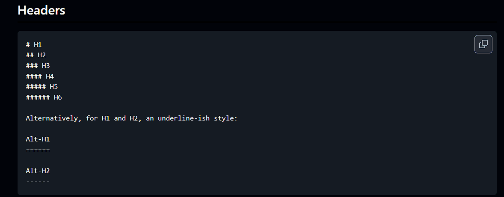

# Projeto com README
Um projeto de teste com um arquivo README 🚀

[](https://google.com)

## Tecnologias Utilizadas
- HTML
- CSS
-JavaScript

## Como utilizar

clone o projeto
```
git clone
```
Acesse a pasta do projeto
```
cd repositorio-com-readme
```